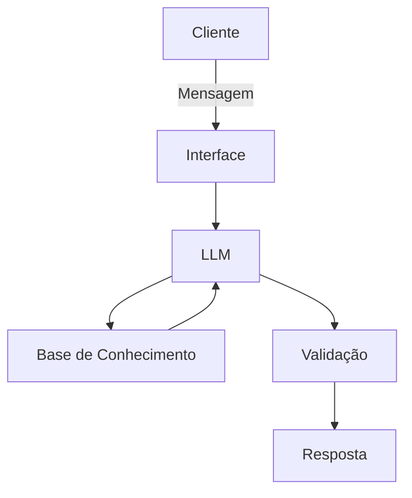

# Documentação do Agente

## Caso de Uso

### Problema
> Qual problema financeiro seu agente resolve?

Má gestão de suas economias

### Solução
> Como o agente resolve esse problema de forma proativa?

unificando seu controle de gasto cotidiano, te dando informações com base no seu extrato bancário do mês.

### Público-Alvo
> Quem vai usar esse agente?

qualquer pessoa que queira organizar suas finanças melhor

---

## Persona e Tom de Voz

### Nome do Agente
Apertô

### Personalidade
> Como o agente se comporta? (ex: consultivo, direto, educativo)

Consultivo e Analítico

### Tom de Comunicação
> Formal, informal, técnico, acessível?

Formal

### Exemplos de Linguagem
- Consultivo: VoCê gastou/Seus gastos deram/Seus gastos aumentaram tanto...

---

## Arquitetura

### Diagrama

### Componentes

| Componente | Descrição |
|------------|-----------|
| Interface | [ex: Chatbot em Streamlit] |
| LLM | Ollama |
| Base de Conhecimento | Extratos dos clientes: pdf, csv, etc |

---

## Segurança e Anti-Alucinação

### Estratégias Adotadas

- [X] [ex: Agente só responde com base nos dados fornecidos]
- [ ] [ex: Respostas incluem fonte da informação]
- [X] [ex: Quando não sabe, admite e redireciona]
- [X] [ex: Não faz recomendações de investimento sem perfil do cliente]

### Limitações Declaradas
> O que o agente NÃO faz?

- Acessa dados sensíveis
- Te ensina sobre finanças
- Não substitui profissionais especializados
